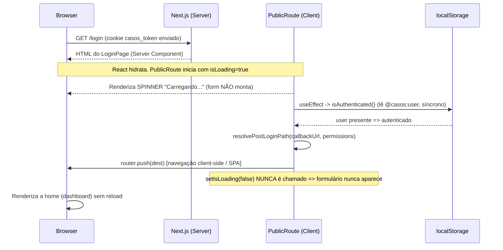
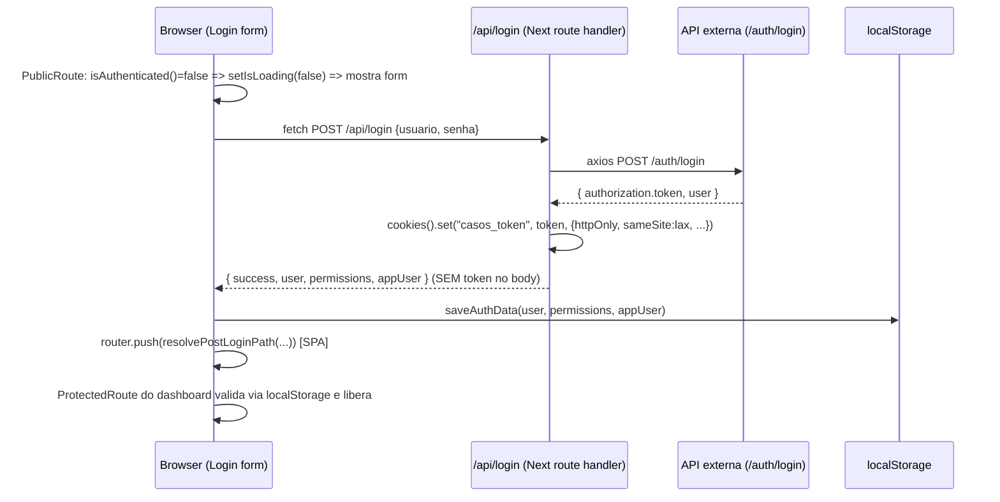

# Fluxo de Autenticação e Redirecionamento da rota `/login`

> Documento técnico investigativo. **Nenhum código foi alterado** — este texto apenas descreve o que já existe no repositório `casos-front`.
>
> Objetivo central: explicar **por que o formulário de login não "pisca"** (flash) quando um usuário já autenticado acessa `/login` — a tela mal aparece e a navegação vai direto para a home.

---

## 1. Stack e versões

| Item | Valor | Evidência |
|------|-------|-----------|
| Framework | **Next.js `16.1.7`** | `package.json` |
| Roteamento | **App Router** (diretório `app/` na raiz, com layouts/route handlers) | `app/layout.tsx`, `app/login/page.tsx` |
| React | **`^18`** | `package.json` |
| Middleware | **Não existe** (`middleware.ts`/`middleware.js` ausente) | `Glob` por `**/{middleware,proxy}.*` → 0 arquivos |
| SSR / RSC | Usa **Server Components** (páginas e route handlers server-side), mas o **guard de auth é 100% client-side** | ver seções 4 e 8 |
| Data fetching client | `@tanstack/react-query ^5.56.2` | `hooks/auth/use-login.tsx` |
| HTTP server→API externa | `axios ^1.14.0` | `lib/axios.ts` |
| Persistência local | Drizzle + Postgres/Supabase (`@supabase/ssr`, `drizzle-orm`) | `package.json` |

Trechos reais das dependências relevantes:

```52:65:package.json
    "next": "16.1.7",
    "next-themes": "^0.4.6",
    "nuqs": "^2.8.9",
    "postgres": "^3.4.8",
    "react": "^18",
    "react-day-picker": "^9.14.0",
    "react-dom": "^18",
    "react-hook-form": "^7.71.1",
```

O `next.config.js` **não define `rewrites`, `redirects` nem `headers`** — apenas `serverExternalPackages`:

```1:12:next.config.js
/** @type {import('next').NextConfig} */
const nextConfig = {
  serverExternalPackages: [
    "discord.js",
    "@discordjs/ws",
    "@discordjs/rest",
    "zlib-sync",
    "bufferutil",
    "utf-8-validate",
  ],
};

module.exports = nextConfig;
```

---

## 2. Onde a sessão é armazenada

A sessão é **dual** — dois artefatos com papéis distintos:

### 2.1. Token real → cookie `HttpOnly` (servidor)

- **Nome do cookie:** `casos_token`
- **`httpOnly: true`** → o JavaScript do cliente **nunca** lê o token.
- **`secure`** apenas em produção.
- **`sameSite: "lax"`**, **`path: "/"`**, **`maxAge` = 7 dias**.

```1:13:lib/auth-server.ts
import { cookies } from "next/headers";

/** Nome do cookie HttpOnly onde o token é armazenado (apenas no servidor). */
export const AUTH_COOKIE_NAME = "casos_token";

/** Opções padrão do cookie de autenticação (HttpOnly, Secure em produção). */
export const AUTH_COOKIE_OPTIONS = {
  httpOnly: true,
  secure: process.env.NODE_ENV === "production",
  sameSite: "lax" as const,
  path: "/",
  maxAge: 60 * 60 * 24 * 7, // 7 dias
};
```

> **Observação:** não há atributo `Domain` explícito → o cookie fica restrito ao host que respondeu (host-only). É `first-party` da própria aplicação Next.

O cookie é **setado no servidor**, dentro do route handler `POST /api/login`, depois de trocar credenciais com a API externa e sincronizar o usuário:

```50:52:app/api/login/route.ts
    const store = await cookies();
    store.set(AUTH_COOKIE_NAME, token, AUTH_COOKIE_OPTIONS);
```

Importante: o **token não volta no body** da resposta — só `user`, `permissions` e `appUser`:

```55:70:app/api/login/route.ts
    // Não expor o token no body — apenas user, permissões locais e success
    return Response.json(
      {
        success: true,
        user,
        permissions,
        appUser: appUserToSummary(appUser),
        filtrosResumo,
      },
      {
        status: response.status,
        headers: { "Content-Type": "application/json" },
      }
    );
```

### 2.2. Espelho do usuário → `localStorage` (cliente)

Como o token é `HttpOnly`, o **cliente não consegue** perguntar "estou logado?" olhando o cookie. Para isso existe um **espelho em `localStorage`** com o objeto `user`, gravado após o login:

```34:51:lib/auth.ts
/** Token não é mais exposto ao cliente — fica apenas em cookie HttpOnly no servidor. */
const USER_KEY = "@casos:user";

const PERMISSIONS_KEY = "@casos:permissions";

const APP_USER_KEY = "@casos:appUser";
```

```37:51:lib/auth.ts
export function saveAuthData(data: {
  user: User;
  permissions?: string[];
  appUser?: AppUserSummary;
}) {
  if (typeof window !== "undefined") {
    localStorage.setItem(USER_KEY, JSON.stringify(data.user));
    if (data.permissions !== undefined) {
      localStorage.setItem(PERMISSIONS_KEY, JSON.stringify(data.permissions));
    }
    if (data.appUser !== undefined) {
      localStorage.setItem(APP_USER_KEY, JSON.stringify(data.appUser));
    }
  }
}
```

O `getToken()` no cliente é **propositalmente um no-op** que retorna `null`, e `isAuthenticated()` decide apenas pela presença do `user` no `localStorage`:

```64:66:lib/auth.ts
export function getToken(): string | null {
  return null;
}
```

```142:145:lib/auth.ts
/** Considera autenticado se há user salvo (cookie é validado nas requisições ao servidor). */
export function isAuthenticated(): boolean {
  return getUser() !== null;
}
```

**Resumo do modelo de sessão:** o `localStorage` (`@casos:user`) é a fonte de verdade **para gating de UI no cliente**; o cookie `HttpOnly` `casos_token` é a fonte de verdade **para autenticação real no servidor** (repassado como `Authorization: Bearer` para a API externa).

---

## 3. Arquitetura de domínio / origem

Há **duas origens** envolvidas, mas o navegador só conversa com uma:

1. **Front + BFF (mesma origem):** a aplicação Next.js serve tanto as páginas quanto os **route handlers** em `app/api/*`. O browser fala só com o Next (ex.: `POST /api/login`).
2. **API externa (outra origem):** definida por `NEXT_PUBLIC_API_BASE_URL`, acessada **somente pelo servidor Next** via axios — o browser nunca a chama diretamente.

```1:9:lib/axios.ts
import axios from 'axios'

export const api = axios.create({
  baseURL: process.env.NEXT_PUBLIC_API_BASE_URL,
  headers: {
    'Content-Type': 'application/json',
    Accept: 'application/json',
  },
})
```

```4:8:.env.example
# API Base URL
NEXT_PUBLIC_API_BASE_URL=API_BASE_URL
```

Fluxo da credencial (padrão **Backend-for-Frontend**):

- Browser → `POST /api/login` (mesma origem do Next).
- Route handler → `api.post("/auth/login", body)` para a **API externa**.
- Route handler → grava o cookie `casos_token` **na resposta da própria origem Next**.

```16:17:app/api/login/route.ts
    const response = await api.post("/auth/login", body);
    const data = await response.data;
```

**Não há proxy/rewrite no `next.config.js` nem multi-tenant por subdomínio.** Como o cookie é `first-party` (host-only) e `SameSite=Lax`, ele é automaticamente reenviado pelo navegador a qualquer requisição para a mesma origem — inclusive a navegação que renderiza `/login` e as chamadas subsequentes a `/api/*`. No servidor, o cookie é lido com `cookies()`:

```19:23:lib/auth-server.ts
export async function getTokenFromCookie(): Promise<string | null> {
  const store = await cookies();
  const cookie = store.get(AUTH_COOKIE_NAME);
  return cookie?.value ?? null;
}
```

> Nota: como o guard de `/login` é client-side (seção 4), o cookie **não é usado** para decidir o redirect da tela de login — ele serve às rotas `/api/*` e Server Components que precisam do `Authorization`.

---

## 4. Guard da rota `/login`

O redirecionamento de "usuário já logado que abre `/login`" acontece **no cliente**, dentro do componente `PublicRoute`, e **não** no middleware nem em Server Component.

A página `/login` é um Server Component que apenas resolve o `callbackUrl` e envolve o formulário no guard `PublicRoute`:

```10:24:app/login/page.tsx
export default async function LoginPage({
  searchParams,
}: {
  searchParams: Promise<{ callbackUrl?: string }>;
}) {
  const sp = await searchParams;
  const callbackUrl =
    typeof sp.callbackUrl === "string" ? sp.callbackUrl : undefined;

  return (
    <PublicRoute callbackUrl={callbackUrl}>
      <Login callbackUrl={callbackUrl} />
    </PublicRoute>
  );
}
```

O `PublicRoute` (client component) é o coração do "não pisca":

```1:43:components/public-route.tsx
"use client";

import { useEffect, useState } from "react";
import { useRouter } from "next/navigation";
import { getPermissions, isAuthenticated } from "@/lib/auth";
import { resolvePostLoginPath } from "@/lib/post-login-redirect";

interface PublicRouteProps {
  children: React.ReactNode;
  /** Query `callbackUrl` da página de login (rota interna segura após já autenticado). */
  callbackUrl?: string;
}

export function PublicRoute({ children, callbackUrl }: PublicRouteProps) {
  const router = useRouter();
  const [isLoading, setIsLoading] = useState(true);

  useEffect(() => {
    const checkAuth = () => {
      if (isAuthenticated()) {
        const dest = resolvePostLoginPath(callbackUrl, getPermissions());
        router.push(dest);
      } else {
        setIsLoading(false);
      }
    };

    checkAuth();
  }, [router, callbackUrl]);

  if (isLoading) {
    return (
      <div className="min-h-screen flex items-center justify-center bg-background">
        <div className="text-center">
          <div className="animate-spin rounded-full h-12 w-12 border-b-2 border-primary mx-auto"></div>
          <p className="mt-4 text-muted-foreground">Carregando...</p>
        </div>
      </div>
    );
  }

  return <>{children}</>;
}
```

**Mecânica exata:**

1. Estado inicial `isLoading = true` → o guard renderiza um **spinner "Carregando..."**, **nunca** o formulário. O `<Login>` é `children` e só é montado quando `isLoading` vira `false`.
2. No `useEffect` (após montagem), roda `isAuthenticated()`, que lê `localStorage` de forma **síncrona e sem rede**.
3. Se **autenticado** → `router.push(dest)` e **`setIsLoading(false)` nunca é chamado** → o formulário **jamais monta**; só o spinner aparece por instantes até a navegação client-side ocorrer.
4. Se **não autenticado** → `setIsLoading(false)` → aí sim o `<Login>` (formulário) é renderizado.

O redirect **NÃO** é `redirect()`/`NextResponse.redirect` (server-side) — é `router.push()` (client-side). Portanto ele **não** ocorre "antes de qualquer HTML/paint": o HTML do spinner é pintado; o que **não** é pintado é o formulário, porque ele fica atrás do gate `isLoading`.

O destino é calculado por `resolvePostLoginPath`, que valida o `callbackUrl` (anti open-redirect) e cai numa landing page por permissão:

```47:59:lib/post-login-redirect.ts
export function resolvePostLoginPath(
  callbackUrl: string | null | undefined,
  permissions: string[] | null | undefined,
): string {
  const perms = permissions ?? [];
  const safePath = getSafeInternalReturnPath(callbackUrl);

  if (safePath && canAccessPath(safePath, perms)) {
    return safePath;
  }

  return getDefaultLandingPath(perms);
}
```

```7:19:lib/post-login-redirect.ts
/** Primeira rota "home" que o usuário pode acessar (ordem alinhada ao menu). */
export function getDefaultLandingPath(permissions: string[]): string {
  if (permissions.includes("list-painel-dev")) return "/painel";
  if (hasAny(permissions, ["list-case", "list-report"])) return "/casos";
  if (permissions.includes("list-project")) return "/projetos";
  if (hasAny(permissions, ["audit-all-users", "audit-user"])) {
    return "/auditoria/horas-colaboradores";
  }
  if (permissions.includes("list-acquirer")) return "/cadastros/adquirentes";
  if (permissions.includes("list-user")) return "/configuracoes/usuarios";
  if (permissions.includes("assign-user-role")) return "/configuracoes/perfis";
  return "/avisos";
}
```

> **Guard espelho do lado protegido:** o grupo `(dashboard)` usa `ProtectedRoute` com a lógica inversa — se **não** autenticado, `router.push("/login?callbackUrl=...")`. Mesmo padrão de gate por `isLoading`, evitando flash do dashboard. Ver `components/protected-route.tsx` (linhas 24–35).

---

## 5. Fluxo de login por email/senha

É **chamada client (`fetch`) + navegação client**, **não** server action / form POST tradicional.

1. O formulário (`components/login/login-form.tsx`) é um client component com `react-hook-form` + `zod`; o submit chama `onSubmit` de `components/login/login.tsx`.
2. `onSubmit` dispara a mutation `useLogin` (React Query):

```1:8:hooks/auth/use-login.tsx
import { useMutation } from "@tanstack/react-query";
import { login as loginService } from "@/services/auth/login";

export function useLogin() {
    return useMutation({
        mutationFn: ({ usuario, senha }: { usuario: string, senha: string }) => loginService({ usuario, senha }),
    });
}
```

3. O service faz `fetch("/api/login")` (mesma origem):

```29:50:services/auth/login.ts
export async function login({
  usuario,
  senha,
}: LoginParams): Promise<LoginResponse> {
  const response = await fetch("/api/login", {
    method: "POST",
    headers: {
      "Content-Type": "application/json",
    },
    body: JSON.stringify({
      usuario,
      senha,
    }),
  });

  if (!response.ok) {
    const error = await response.json();
    console.log(error);
  }

  return await response.json();
}
```

4. O route handler `/api/login` (servidor) troca credenciais com a API externa, **seta o cookie `casos_token`** (seção 2.1) e devolve `user`/`permissions`/`appUser`.
5. De volta no cliente, `onSubmit` grava o espelho em `localStorage` via `saveAuthData(...)` e navega com `router.push(dest)`:

```56:92:components/login/login.tsx
  async function onSubmit(data: LoginFormData) {
    try {
      const response = await mutateAsync({
        usuario: data.email,
        senha: data.password,
      });

      if (response.success && response.user) {
        saveAuthData({
          user: response.user,
          permissions: response.permissions,
          appUser: response.appUser,
        });

        if (response.appUser?.id && response.filtrosResumo?.length) {
          writeCasosFiltrosPreferencias(
            response.appUser.id,
            response.filtrosResumo,
          );
        }

        if (rememberMe) {
          localStorage.setItem(REMEMBER_ME_KEY, "true");
          localStorage.setItem(REMEMBERED_EMAIL_KEY, data.email);
        } else {
          localStorage.removeItem(REMEMBER_ME_KEY);
          localStorage.removeItem(REMEMBERED_EMAIL_KEY);
        }

        const dest = resolvePostLoginPath(callbackUrl, response.permissions);
        router.push(dest);
      }
    } catch (error) {
      toast.error("Credenciais inválidas");
      console.error(error);
    }
  }
```

Em resumo: **cookie é setado no servidor** (dentro do handler), mas o **redirect é client-side** (`router.push`) após a resposta.

---

## 6. OAuth (Google / Facebook)

**Não existe login social/OAuth neste projeto.** Não há `signInWithOAuth`, `signInWithPassword`, provider Google/Facebook, nem rota `app/api/auth/callback`. A busca por `signInWithOAuth|/auth/callback|oauth|redirectTo` no código de autenticação não retorna nenhum handler de OAuth (os matches de "provider" são React Context Providers, e "google" aparece só em contexto de fontes/UI).

As únicas rotas em `app/api/auth/` são:

- `app/api/auth/logout/route.ts`
- `app/api/auth/refresh/route.ts`

O único mecanismo de autenticação é **email/senha via `POST /api/login`** contra a API externa (`/auth/login`).

---

## 7. UX de transição

- **Não há `loading.tsx`** em nenhuma rota (`Glob app/**/loading.tsx` → 0 arquivos), então não se usa o loading de segmento do App Router para essa transição.
- **Não há skeleton específico** entre `/login` e a home.
- A "tela branca" é evitada de duas formas complementares:
  1. **No `/login`:** o gate `isLoading` do `PublicRoute` mantém um **spinner de página inteira** (`min-h-screen`, fundo `bg-background`) enquanto decide/redireciona — nunca uma tela em branco nem o formulário.
  2. **No destino (dashboard):** o `AppLayout` envolve o conteúdo em `ProtectedRoute` (que também exibe o mesmo spinner enquanto valida) e usa `Suspense`:

```87:98:app/(dashboard)/layout.tsx
export default function AppLayout({ children }: { children: React.ReactNode }) {
  return (
    <ProtectedRoute>
      <SidebarProvider>
        <Suspense fallback={null}>
          <AppLayoutContent>{children}</AppLayoutContent>
        </Suspense>
      </SidebarProvider>
    </ProtectedRoute>
  );
}
```

Como `router.push` é uma **navegação client-side** (SPA) no App Router, não há full page reload nem tela branca do navegador — apenas a troca de árvore React, coberta pelos spinners dos guards.

---

## 8. Resumo do "porquê não pisca"

O formulário não pisca porque ele **fica atrás de um gate de carregamento pessimista**. O `PublicRoute` inicia com `isLoading = true` e, nesse estado, renderiza um **spinner** — nunca o `<Login>`. A verificação de sessão roda no `useEffect` lendo o `localStorage` de forma **síncrona e sem rede** (`isAuthenticated()`); para um usuário já autenticado ela chama `router.push(dest)` e **jamais executa `setIsLoading(false)`**, de modo que o formulário **nunca chega a montar** — só o spinner aparece por um instante antes da navegação client-side. Ou seja: o que "mal pisca" é o spinner de carregamento, e o redirect é uma transição de SPA (sem reload), evitando tela branca. O único ponto de flash possível seria um brevíssimo spinner, não o formulário.

**Arquivos-chave envolvidos:**

- `app/login/page.tsx` — Server Component que envolve o formulário no guard.
- `components/public-route.tsx` — **guard client-side** com gate `isLoading` (o "porquê não pisca").
- `lib/auth.ts` — `isAuthenticated()` / `saveAuthData()` (espelho em `localStorage`).
- `lib/post-login-redirect.ts` — cálculo do destino pós-login.
- `lib/safe-callback-url.ts` — validação anti open-redirect do `callbackUrl`.
- `app/api/login/route.ts` + `lib/auth-server.ts` — set do cookie `HttpOnly` `casos_token` no servidor.
- `components/login/login.tsx` / `hooks/auth/use-login.tsx` / `services/auth/login.ts` — submit e navegação.
- `app/(dashboard)/layout.tsx` + `components/protected-route.tsx` — guard espelho no destino.

---

## 9. Diagrama do fluxo (Mermaid)

### 9.1. Usuário **já autenticado** acessa `/login`



### 9.2. Usuário **não autenticado** (fluxo de login por senha)


