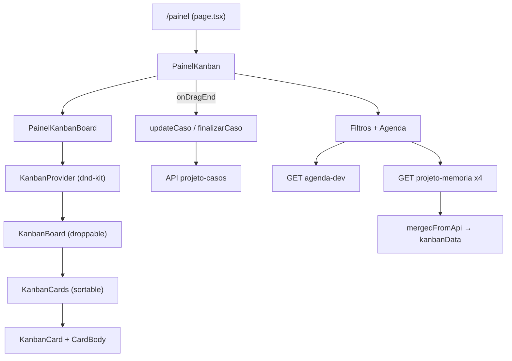

# Kanban do Painel do Desenvolvedor

Documentação da implementação do quadro Kanban na rota `/painel`, com foco em permitir replicar os mesmos comportamentos em outra aplicação.

## 1. Visão geral e stack

O Kanban é composto por **duas camadas**:

1. **Camada genérica/reutilizável** — `components/kibo-ui/kanban/index.tsx`: wrapper de drag-and-drop sem regra de negócio. É a parte a copiar quase 1:1 para outra app.
2. **Camada de domínio** — `components/painel-kanban/**`: define colunas, mapeia dados da API, filtros, paginação e persistência no drop.

### Dependências

| Pacote | Uso |
|--------|-----|
| `@dnd-kit/core` | `DndContext`, sensores, `DragOverlay`, `useDroppable` |
| `@dnd-kit/sortable` | `SortableContext`, `useSortable`, `arrayMove` |
| `@dnd-kit/utilities` | `CSS.Transform` para o estilo do card em arraste |
| `tunnel-rat` | Teleporta o card ativo para o `DragOverlay` (evita corte por `overflow`) |

Não usa `react-beautiful-dnd` nem `react-dnd`.

Estilização: **Tailwind CSS** + shadcn/ui (`Card`, `ScrollArea`, `Button`, etc.).

### Fluxo geral



### Hierarquia de arquivos

```
app/(dashboard)/painel/page.tsx
  └─ PainelKanban (components/painel-kanban/index.tsx)
       ├─ filtros / modais / skeleton
       └─ PainelKanbanBoard
            └─ KanbanProvider / KanbanBoard / KanbanCards / KanbanCard (kibo-ui)
```

---

## 2. Tela “Painel do Desenvolvedor”

| Item | Valor |
|------|--------|
| Rota | `/painel` |
| Arquivo | `app/(dashboard)/painel/page.tsx` |
| Label no menu | `"Painel do desenvolvedor"` (`components/sidebar/app-sidebar.tsx`) |
| Permissão | `list-painel-dev` |
| Título na UI | `"Painel do Desenvolvedor"` |

A página só envolve o container com `RequirePermission` e renderiza `<PainelKanban />`.

---

## 3. Arquivos relevantes

### Núcleo Kanban (board + DnD)

| Arquivo | Papel |
|---------|--------|
| `components/kibo-ui/kanban/index.tsx` | Lib genérica: Provider, Board, Cards, Card, drag handle, DragOverlay |
| `components/painel-kanban/index.tsx` | Container da tela + handlers de persistência no drop |
| `components/painel-kanban/kanban/painel-kanban-board.tsx` | Board de domínio (colunas, busca, infinite scroll) |
| `components/painel-kanban/kanban/painel-kanban-columns.ts` | IDs/meta das colunas + mapeamento status API |
| `components/painel-kanban/kanban/painel-kanban-map.ts` | Tipo `PainelKanbanItem` + mappers/sort/dedupe |
| `components/painel-kanban/kanban/painel-kanban-card-body.tsx` | Conteúdo do card + grip de arraste |
| `components/painel-kanban/kanban/painel-kanban-column-search.tsx` | Busca por coluna |
| `components/painel-kanban/kanban/kanban-column-load-sentinel.tsx` | Sentinel de paginação infinita |

### Hooks

| Arquivo | Papel |
|---------|--------|
| `components/painel-kanban/hooks/use-painel-kanban-queries.ts` | Agenda + 4 queries `projeto-memoria` + merge |
| `components/painel-kanban/hooks/use-painel-kanban-filtros.ts` | Hidratação/persistência de filtros |
| `components/painel-kanban/hooks/use-painel-kanban-projetos-catalogo.ts` | Catálogo de projetos |
| `hooks/casos/use-projeto-memoria.tsx` | Infinite query dos cards |
| `hooks/painel/use-agenda-dev.tsx` | Query da agenda (produtos/contagens) |
| `hooks/casos/use-update-caso.tsx` | Mutation de status no drop |
| `hooks/casos/use-finalizar-caso.tsx` | Mutation especial abertos/retornos → corrigidos |

### Serviços / API

| Arquivo | Endpoint |
|---------|----------|
| `services/projeto-memoria/get-projeto-memoria.ts` | `GET /api/projeto-memoria` |
| `services/auxiliar/get-agenda-dev.ts` | `GET /api/auxiliar/agenda-dev` |
| `services/projeto-casos/update.ts` | `PATCH /api/projeto-casos/{id}` |
| `services/projeto-casos/finalizar-caso.ts` | `POST /api/projeto-casos/finalizar-caso/{id}` |

### Layout / filtros / estilo

| Arquivo | Papel |
|---------|--------|
| `components/painel-kanban/filtros/*` | Barra de filtros, localStorage, bootstrap |
| `components/painel-kanban/layout/painel-kanban-skeleton.tsx` | Skeleton da tela |
| `components/painel-kanban/layout/empty-colums-placeholder.tsx` | Empty state por coluna |
| `app/globals.css` | CSS var `--shadow-kanban-card` |
| `tailwind.config.ts` | Token `shadow-kanban-card` |

> Existe outro Kanban no repo (`components/cadastros/status-adquirentes/kanban/*`) que reutiliza a mesma lib `kibo-ui`, mas **não** é o painel de desenvolvedor.

---

## 4. Camada genérica (`components/kibo-ui/kanban/index.tsx`)

Esta é a parte a extrair para reaproveitar. Exporta: `KanbanProvider`, `KanbanBoard`, `KanbanHeader`, `KanbanCards`, `KanbanCard` e o hook `useKanbanDragHandle`.

### 4.1 Tipos base

```ts
export type KanbanItemProps = {
  id: string;
  name: string;
  column: string;
};

export type KanbanColumnProps = {
  id: string;
  name: string;
};
```

Qualquer app precisa garantir que seus itens tenham `id`, `name` e `column`. Campos extras são permitidos (`T extends KanbanItemProps`).

### 4.2 `KanbanProvider` — coração do drag-and-drop

Cria o `DndContext`, controla sensores e expõe os handlers:

**Sensores**

```ts
const sensors = useSensors(
  useSensor(PointerSensor, {
    activationConstraint: { distance: 8 },
  }),
  useSensor(KeyboardSensor),
);
```

- `activationConstraint: { distance: 8 }` — exige 8px de movimento antes de iniciar o arraste. Permite clique no card (abrir modal) sem conflitar com o DnD.
- `collisionDetection={closestCenter}`.

**`onDragStart`**

- Define `activeCardId` (para o overlay).
- Chama o callback externo `onDragStart?.(event)`.

**`onDragOver` (atualização otimista)**

Quando o card cruza para outra coluna:

1. Atualiza `item.column` no array local.
2. Usa `arrayMove` para reposicionar.
3. Chama `onDataChange?.(newData)` — feedback visual imediato, **antes** de soltar o mouse.

A coluna de destino pode ser:

- a coluna do item sob o cursor (`overItem.column`), ou
- o `id` de uma coluna droppable vazia (`columns.find(col => col.id === over.id)`).

**`onDragEnd`**

1. Limpa `activeCardId`.
2. Chama o callback externo `onDragEnd?.(event)` (onde o domínio persiste na API).
3. Se soltou sobre outro item, reordena com `arrayMove` e chama `onDataChange` de novo.

**Renderização**

- Render prop: `children(column) => ReactNode` — o domínio decide como cada coluna é desenhada.
- `DragOverlay` via `createPortal(..., document.body)` + `tunnel-rat` (`t.In` / `t.Out`) para o card “flutuante” não ser cortado por containers com scroll.
- Anúncios de acessibilidade (`Announcements`) para leitores de tela.

### 4.3 `KanbanBoard` — coluna droppable

```ts
const { isOver, setNodeRef } = useDroppable({ id });
```

Cada coluna é uma área droppable identificada pelo próprio `id`. Quando um card está sobre ela, `isOver` aplica destaque visual (`ring-primary`).

### 4.4 `KanbanCards` — lista sortable

- Filtra `data` do contexto por `item.column === id`.
- Props opcionais: `sortItems`, `filterItems`, `listFooter` (slot para sentinel de infinite scroll).
- Envolve em `SortableContext` com a lista de `ids`.
- Área rolável com `ScrollArea` + `ScrollBar` vertical.

### 4.5 `KanbanCard` — dois modos de arraste

| Modo | Comportamento |
|------|----------------|
| Sem `dragHandle` (padrão) | `listeners`/`attributes` no card inteiro — arrasta clicando em qualquer lugar |
| Com `dragHandle={true}` | Listeners vão para um Context; o conteúdo decide onde fica o grip. Permite `onCardClick` no corpo sem conflitar com o drag |

Com `dragHandle`, o card:

- Expõe `listeners`/`attributes` via `KanbanDragHandleContext`.
- Aplica `onClick` / teclado (Enter/Space) no corpo quando `onCardClick` é passado.
- Fica com `opacity-30` enquanto `isDragging`; o overlay mostra a cópia “sólida”.

### 4.6 Hook `useKanbanDragHandle`

```ts
export function useKanbanDragHandle(): KanbanDragHandleProps | null {
  return useContext(KanbanDragHandleContext);
}
```

Usado no body do card de domínio para plugar os listeners no ícone de grip (`GripVertical`).

---

## 5. Camada de domínio

### 5.1 Colunas

IDs: `abertos` | `corrigidos` | `retornos` | `concluidos`.

Cada coluna tem metadados de UI (`dotClass`, `emptyTitle`, `emptyDescription`) além de `id`/`name`.

Mapeamento coluna → status da API (`columnIdToApiStatus`):

| Coluna | Status API |
|--------|------------|
| `abertos` | `1` |
| `corrigidos` | `3` |
| `retornos` | `4` |
| `concluidos` | `9` |

### 5.2 Tipo do item + mapeamento

```ts
export interface PainelKanbanItem extends Record<string, unknown> {
  id: string;
  name: string;
  column: string;
  numero: string;
  descricao: string;
  importancia: number;
  modulo: string;
  tempoEstimado: string;
  tempoRealizado: string;
  statusTempo: string;
  tipoCategoria: string;
  statusId: string;
}
```

`mapProjetoMemoriaItemToKanban(item, columnId)` transforma o payload da API (`ProjetoMemoriaItem`) nesse formato.

Utilitários:

- `compareKanbanByImportancia` — maior prioridade no topo.
- `dedupePainelKanbanItemsById` — remove duplicatas ao unir as 4 listas.
- `sortAbertosIniciadosPrimeiro` — prioriza itens com `statusTempo === "INICIADO"`.

### 5.3 Board de domínio (`painel-kanban-board.tsx`)

Para cada coluna renderiza:

1. `KanbanHeader` — dot colorido + nome + badge de contagem + busca.
2. Um de três estados internos:
   - **Loading** → `CasosProdutoSkeletonList`
   - **Vazia** → `EmptyColumnPlaceholder`
   - **Com itens** → `KanbanCards` com `sortItems` / `filterItems` / `listFooter`
3. Cada `KanbanCard` com `dragHandle` + `onCardClick` (abre modal de resumo).

Grid responsivo (1→2→3→4 colunas, scroll horizontal + snap):

```txt
auto-cols-[calc(100%-0rem)] snap-x snap-mandatory   /* mobile: 1 coluna */
sm:auto-cols-[calc((100%-1rem)/2)]                  /* 2 */
lg:auto-cols-[calc((100%-2rem)/3)]                  /* 3 */
xl:auto-cols-[calc((100%-3rem)/4)]                  /* 4 */
```

Destaque visual: cards com `statusTempo === "INICIADO"` ganham `border-l-4 border-l-primary`.

### 5.4 Corpo do card (`painel-kanban-card-body.tsx`)

- Consome `useKanbanDragHandle()` e aplica listeners no grip.
- `stopPropagation` no clique/teclado do grip — evita disparar `onCardClick`.
- Exibe: badge de importância, `#numero`, descrição, tempos `E:` / `R:`.
- Botão lápis → navega para `/casos/{id}` (também com `stopPropagation`).

### 5.5 Container (`painel-kanban/index.tsx`) — orquestração e persistência

**Estado local + sync com API**

```ts
const [kanbanData, setKanbanData] = useState<PainelKanbanItem[]>([]);

useEffect(() => {
  setKanbanData(mergedFromApi);
}, [mergedFromApi]);
```

`onDataChange={setKanbanData}` alimenta a atualização otimista durante o `dragOver`.

**`onDragStart`** — guarda a coluna de origem em um `ref`:

```ts
columnDragStartRef.current = row?.column ?? "";
```

**`onDragEnd` — regras de persistência**

1. Resolve a coluna de destino (`over` pode ser um **card** ou a **coluna** vazia).
2. Se `fromCol === targetCol` (ou faltam dados) → **não** chama API (só reordenação local).
3. Regra especial: `abertos|retornos → corrigidos` → `finalizarCaso.mutate(id)`.
4. Demais mudanças → `updateCaso.mutate({ id, data: { status } })`.
5. Em sucesso **ou** erro: invalida `["projeto-memoria"]` e `["agenda-dev"]` + toast. O refetch realinha o estado (rollback natural em caso de erro).

Padrão importante: a UI já mudou otimisticamente; a mutation só confirma no backend.

---

## 6. Fetch e persistência

### Leitura

| Fonte | Hook | Params principais |
|-------|------|-------------------|
| Agenda (produtos + totais) | `useAgendaDev` | `id_colaborador`, opcional `Cronograma_id` |
| Cards por coluna | 4× `useProjetoMemoria` (infinite) | `usuario_dev_id`, `produto_id`, `versao_produto`, `projeto_id?`, `status_id`, `per_page: 15` |

Status por coluna na query:

| Coluna | `status_id` |
|--------|-------------|
| abertos | `["1","2"]` |
| corrigidos | `"3"` |
| retornos | `"4"` |
| concluidos | `"9"` |

- Badges usam contagens da agenda (`abertos`, `corrigidos`, `retornos`, `resolvidos`), não só o `length` local.
- Refetch automático: `AUTO_REFETCH_INTERVAL_MS` (5 minutos).
- Merge + dedupe → `mergedFromApi` → sincroniza `kanbanData`.

### Escrita

| Ação | Service | HTTP |
|------|---------|------|
| Mudança de status | `updateCaso` | `PATCH /api/projeto-casos/{id}` body `{ status }` |
| Finalizar (→ corrigidos) | `finalizarCaso` | `POST /api/projeto-casos/finalizar-caso/{id}` |

### Filtros persistidos

`localStorage` (`PAINEL_KANBAN_FILTROS` + chave de ordem de produto). Produto + versão são obrigatórios para habilitar as queries (`queryEnabled`).

### Infinite scroll por coluna

`KanbanColumnLoadSentinel` usa `IntersectionObserver` (`rootMargin: "100px"`). Quando o sentinel entra na viewport e `hasNextPage`, chama `fetchNextPage()`. Enquanto busca, mostra skeleton.

---

## 7. Loading / erro / empty

| Situação | Comportamento |
|----------|----------------|
| Sem colaborador logado | `EmptyState` “Sessão inválida” |
| Filtros não hidratados / 1ª carga da agenda | `PainelKanbanSkeleton` |
| Sem produto/versão válidos | Empty “Selecione produto e versão” |
| Coluna carregando | `CasosProdutoSkeletonList` |
| Coluna vazia | `EmptyColumnPlaceholder` |
| Erro no drop | `toast.error` + invalidate (rollback via refetch) |
| Sucesso no drop | `toast.success` + invalidate |

---

## 8. Estilização

- Tailwind + tokens do design system (`bg-card`, `border-border-divider`, `text-text-primary`, etc.).
- Shadow específica: `--shadow-kanban-card` → utilitário `shadow-kanban-card`.
- Sem CSS Modules / styled-components no Kanban.
- Responsivo: 1→2→3→4 colunas com scroll horizontal + snap.

---

## 9. Regras de negócio específicas

Avalie o que faz sentido replicar na outra aplicação:

1. Permissão de tela: `list-painel-dev`.
2. “Ver como”: só com `audit-all-users`; troca o desenvolvedor visualizado.
3. Filtro produto/versão obrigatório para carregar cards.
4. Projeto opcional (`Cronograma_id` / `projeto_id`).
5. **Finalizar caso** ao arrastar abertos/retornos → corrigidos (endpoint diferente do PATCH de status).
6. Busca por coluna (client-side, descrição/nome).
7. Ordenação por importância; destaque `statusTempo === "INICIADO"`.
8. Dedupe por `id` ao mergear as 4 listas.
9. Paginação infinita por coluna (`cursor`).
10. Clique no card → modal de resumo; lápis → tela de edição.

---

## 10. Checklist para replicar em outra app

1. Instalar: `@dnd-kit/core`, `@dnd-kit/sortable`, `@dnd-kit/utilities`, `tunnel-rat`.
2. Copiar/adaptar `components/kibo-ui/kanban/index.tsx` (camada genérica; só depende de `Card`/`ScrollArea`/`cn` do design system).
3. Definir colunas (`id`, `name`, meta visual) e tipo de item (`id`, `name`, `column` + campos de UI).
4. Board de domínio: `KanbanProvider` + render de `KanbanBoard` / `KanbanCards` / `KanbanCard` (decidir se usa `dragHandle`).
5. Estado local `data` + `onDataChange` para update otimista no `dragOver`.
6. Em `onDragEnd`: se a coluna mudou → mutation API; invalidar/refetch em sucesso e erro.
7. Fetch: uma query (ou N por coluna) → mapear para `KanbanItem[]`.
8. Estilo: Tailwind (ou equivalente) + sombra/card tokens; grid responsivo se quiser o mesmo “carrossel” no mobile.

### Padrão mínimo de integração (domínio)

```tsx
const [data, setData] = useState<MyItem[]>([]);
const fromColRef = useRef("");

// sync com API
useEffect(() => { setData(fromApi); }, [fromApi]);

const onDragStart = (e: DragStartEvent) => {
  fromColRef.current = data.find(i => i.id === e.active.id)?.column ?? "";
};

const onDragEnd = (e: DragEndEvent) => {
  // resolver targetCol a partir de over (item ou coluna)
  // se fromCol !== targetCol → mutação + invalidate
};

return (
  <KanbanProvider
    columns={columns}
    data={data}
    onDataChange={setData}
    onDragStart={onDragStart}
    onDragEnd={onDragEnd}
  >
    {(column) => (
      <KanbanBoard id={column.id}>
        <KanbanHeader>{column.name}</KanbanHeader>
        <KanbanCards id={column.id}>
          {(item) => (
            <KanbanCard id={item.id} name={item.name} column={item.column} dragHandle>
              <MyCardBody item={item} />
            </KanbanCard>
          )}
        </KanbanCards>
      </KanbanBoard>
    )}
  </KanbanProvider>
);
```

---

## 11. Resumo do comportamento DnD (o que copiar)

| Evento | Quem trata | O que faz |
|--------|------------|-----------|
| Pointer move ≥ 8px | `PointerSensor` | Inicia arraste |
| Drag start | Provider + domínio | Overlay ativo; domínio guarda coluna origem |
| Drag over (mudou coluna) | Provider | Muda `item.column` + `onDataChange` (otimista) |
| Drag end (mesma coluna) | Provider | Só `arrayMove` local; domínio **não** chama API |
| Drag end (outra coluna) | Domínio | Mutation de status / finalizar; toast; invalidate queries |
| Overlay | tunnel-rat + portal | Card flutuante fora da árvore de scroll |
| Clique vs drag | `dragHandle` + distance 8 | Clique abre modal; grip inicia arraste |
